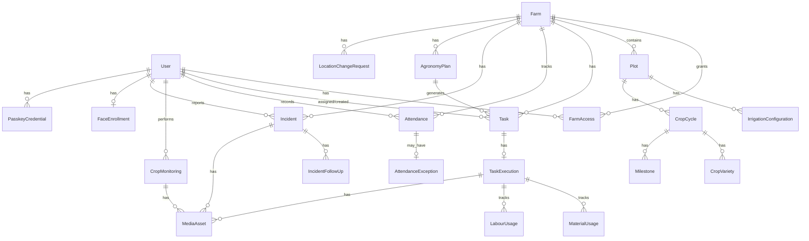

# Agaate Farm Management PWA — Technical Design Document (TDD)


<!-- cortex:toc -->
- [1. System Architecture Overview](#1-system-architecture-overview)
  - [1.1 Tech Stack](#11-tech-stack)
  - [1.2 Architecture Pattern](#12-architecture-pattern)
  - [1.3 Key Architectural Decisions](#13-key-architectural-decisions)
- [2. Directory Structure](#2-directory-structure)
- [3. Database Design](#3-database-design)
  - [3.1 Entity-Relationship Overview](#31-entity-relationship-overview)
  - [3.2 Core Models (20 models)](#32-core-models-20-models)
  - [3.3 Authentication Models](#33-authentication-models)
  - [3.4 Enum Types (14 enums)](#34-enum-types-14-enums)
  - [3.5 Index Strategy](#35-index-strategy)
- [4. API Design](#4-api-design)
  - [4.1 API Route Inventory (44 endpoints)](#41-api-route-inventory-44-endpoints)
    - [Authentication & Security](#authentication--security)
    - [Farm Management](#farm-management)
    - [Task & Activity Management](#task--activity-management)
    - [Attendance & Location](#attendance--location)
    - [Monitoring & Incidents](#monitoring--incidents)
    - [Media & Reporting](#media--reporting)
    - [Dashboard & Users](#dashboard--users)
  - [4.2 Error Handling Pattern](#42-error-handling-pattern)
  - [4.3 Access Control Pattern](#43-access-control-pattern)
- [5. Authentication & Security](#5-authentication--security)
  - [5.1 Session Management](#51-session-management)
  - [5.2 Biometric Pipeline](#52-biometric-pipeline)
  - [5.3 Security Measures](#53-security-measures)
- [6. Infrastructure](#6-infrastructure)
  - [6.1 Local Development](#61-local-development)
  - [6.2 Environment Configuration](#62-environment-configuration)
  - [6.3 NPM Scripts](#63-npm-scripts)
- [7. Testing Strategy](#7-testing-strategy)
  - [7.1 Test Files](#71-test-files)
  - [7.2 Testing Tools](#72-testing-tools)
- [8. Performance Considerations](#8-performance-considerations)
<!-- cortex:toc:end -->

**Version:** 1.0  
**Date:** 2026-08-30  
**Status:** Active Implementation

---

## 1. System Architecture Overview

### 1.1 Tech Stack

| Layer | Technology | Version |
|---|---|---|
| **Frontend** | Next.js (App Router) + React | 16.3.3 / 19.2.8 |
| **Language** | TypeScript | 5.8.3 |
| **Styling** | Vanilla CSS (globals.css design system) | — |
| **Database** | PostgreSQL | 16 (Alpine) |
| **ORM** | Prisma | 6.8.2 |
| **Authentication** | Session Cookie (jose JWT), bcryptjs | — |
| **Object Storage** | S3-compatible (AWS S3 / MinIO for dev) | — |
| **Validation** | Zod | 3.24.4 |
| **Testing** | Vitest (unit & integration), Playwright (E2E) | 3.2.1 / 1.62.1 |
| **Container** | Docker Compose (PostgreSQL + MinIO) | — |

### 1.2 Architecture Pattern

```
┌─────────────────────────────────────────────────────────┐
│                    PWA (Browser)                         │
│  ┌──────────┐  ┌──────────┐  ┌───────────────────────┐  │
│  │ React    │  │ Service  │  │ Native Camera Capture │  │
│  │ Pages    │  │ Worker   │  │ & HTML5 Geolocation   │  │
│  └────┬─────┘  └──────────┘  └───────────────────────┘  │
└───────┼─────────────────────────────────────────────────┘
        │ HTTPS
┌───────┼─────────────────────────────────────────────────┐
│       ▼ Next.js 16 Server                                │
│  ┌──────────┐  ┌──────────┐  ┌──────────┐               │
│  │ Server   │  │ API      │  │ Server   │               │
│  │ Comps    │  │ Routes   │  │ Actions  │               │
│  │ (RSC)    │  │ (/api/*) │  │          │               │
│  └────┬─────┘  └────┬─────┘  └────┬─────┘               │
│       │              │             │                     │
│  ┌────▼──────────────▼─────────────▼─────┐               │
│  │     Shared Server Libraries           │               │
│  │  auth.ts │ access.ts │ business.ts    │               │
│  │  api.ts  │ audit.ts  │ storage.ts     │               │
│  └────┬──────────────────────┬───────────┘               │
│       │                      │                           │
│  ┌────▼─────┐          ┌─────▼────┐                      │
│  │ Prisma   │          │ S3/MinIO │                      │
│  │ Client   │          │ Client   │                      │
│  └────┬─────┘          └─────┬────┘                      │
└───────┼──────────────────────┼──────────────────────────┘
        │                      │
   ┌────▼─────┐          ┌─────▼────┐
   │PostgreSQL│          │  MinIO   │
   │  16      │          │  S3      │
   └──────────┘          └──────────┘
```

### 1.3 Key Architectural Decisions

| Decision | Rationale |
|---|---|
| **Server Components by default** | Minimize client JS bundle; data fetching at server |
| **API Routes for mutations** | Client components call REST endpoints for all writes |
| **No UI component library** | Vanilla CSS design system for full control, zero bundle overhead |
| **Client-side face recognition** | Privacy: raw face images never leave the device; only encrypted embeddings are stored |
| **S3-compatible storage** | Presigned URLs for direct browser uploads; MinIO for local dev parity |
| **JWT in HttpOnly cookies** | Secure, stateless auth with 8h expiry |
| **Prisma with raw enums** | Strong typing via generated client; schema-as-code for migrations |

---

## 2. Directory Structure

```
agaateapp/
├── docs/                          # Project documentation
├── prisma/
│   ├── schema.prisma              # Database schema (512 lines, 20+ models)
│   ├── migrations/                # Prisma migration history
│   └── seed.ts                    # Comprehensive seed data
├── public/                        # Static assets, PWA manifest
├── scripts/
│   └── fetch-face-models.mjs      # Downloads face-api model weights
├── src/
│   ├── app/
│   │   ├── layout.tsx             # Root layout (PWA meta, service worker)
│   │   ├── globals.css            # Design system (~24KB)
│   │   ├── manifest.ts            # PWA manifest generator
│   │   ├── page.tsx               # Root redirect
│   │   ├── login/                 # Login page
│   │   ├── dashboard/             # Role-aware dashboard
│   │   ├── admin/
│   │   │   ├── approvals/         # Attendance exception + location change approvals
│   │   │   └── users/             # User management (CRUD)
│   │   ├── farms/
│   │   │   ├── new/               # Farm creation form
│   │   │   └── [farmId]/          # Farm detail / hub page
│   │   ├── plots/
│   │   │   └── [plotId]/          # Plot detail + crop cycle management
│   │   │       └── crop-cycles/
│   │   │           ├── new/       # Crop cycle creation wizard
│   │   │           └── [cycleId]/edit/
│   │   ├── tasks/
│   │   │   ├── page.tsx           # Task board (filterable)
│   │   │   └── new/               # Task creation form
│   │   ├── officer/
│   │   │   ├── day/               # Farm Officer "My Day" screen
│   │   │   └── reports/           # Officer field reports
│   │   ├── reports/
│   │   │   └── daily/             # Auto-generated daily reports
│   │   ├── settings/
│   │   │   ├── biometric/         # Face enrollment management
│   │   │   └── passkeys/          # WebAuthn credential management
│   │   └── api/                   # 44 API route handlers (see §4)
│   ├── components/                # 34 React components + UI primitives
│   │   ├── ui/                    # Reusable UI components
│   │   ├── biometric/             # Biometric-related components
│   │   └── webauthn/              # WebAuthn-related components
│   └── lib/                       # Server-side utilities
│       ├── auth.ts                # Session management (JWT)
│       ├── access.ts              # RBAC + farm access control
│       ├── business.ts            # Domain logic (geo, infrastructure, milestones)
│       ├── api.ts                 # Error handling, pagination
│       ├── audit.ts               # Audit logging
│       ├── prisma.ts              # Prisma client singleton
│       ├── storage.ts             # S3 presigned URL helpers
│       ├── rate-limit.ts          # In-memory rate limiter
│       ├── face-*.ts              # Face recognition utilities
│       └── webauthn.ts            # WebAuthn server helpers
├── tests/                         # Test files
├── docker-compose.yml             # PostgreSQL + MinIO
├── package.json                   # Dependencies & scripts
├── tsconfig.json                  # TypeScript configuration
├── vitest.config.ts               # Vitest configuration
└── playwright.config.ts           # E2E test configuration
```

---

## 3. Database Design

### 3.1 Entity-Relationship Overview



### 3.2 Core Models (20 models)

| Model | Purpose | Key Fields |
|---|---|---|
| `User` | All platform users | name, email, passwordHash, role, active |
| `Farm` | Farm entity | name, ownerName, location, lat/long, area, status, geofenceRadius |
| `FarmAccess` | M:N User↔Farm with canManage flag | userId, farmId, canManage |
| `Plot` | Sub-division of farm | name, area, lat/long, soilType, status, deletedAt (soft delete) |
| `IrrigationConfiguration` | Multiple irrigation types per plot | plotId, type, details |
| `CropCycle` | Crop lifecycle per plot | cropName, dates, establishmentType, infrastructure fields |
| `CropVariety` | Varieties within a crop cycle | name, cropCycleId |
| `Milestone` | Crop planning milestones | name, targetDate, status, remarks |
| `AgronomyPlan` | 7-day plans per farm | farmId, planDate, notes, manual weather data |
| `Task` | Work items from all sources | origin, category, title, priority, dueDate, status |
| `TaskExecution` | Officer's execution of a task | startedAt, completedAt, remarks |
| `MaterialUsage` | Materials consumed per task | materialName, quantity, unit |
| `LabourUsage` | Labour tracking per task | labourers, hours, labourHours |
| `Attendance` | Daily start/end with biometric data | date, time, selfie, location, biometric flags |
| `AttendanceException` | Location mismatch exceptions | distanceMeters, reason, approvalStatus |
| `LocationChangeRequest` | Farm location update requests | proposedLat/Long, reason, approvalStatus |
| `CropMonitoring` | Daily crop health reports | status (Good/Poor), stage, impactPercent |
| `Incident` | Farm/plot/crop level incidents | level, type, severity, impactPercent, status |
| `IncidentFollowUp` | Follow-up actions on incidents | action, remarks |
| `MediaAsset` | All uploaded files | storageKey, kind, mimeType, sizeBytes |

### 3.3 Authentication Models

| Model | Purpose |
|---|---|
| `PasskeyCredential` | WebAuthn device credentials |
| `WebAuthnChallenge` | Challenge-response for WebAuthn flows |
| `FaceEnrollment` | Encrypted face embedding storage |
| `LivenessChallenge` | Anti-spoofing challenge tracking |
| `AuditLog` | Complete action audit trail |

### 3.4 Enum Types (14 enums)

`Role`, `FarmStatus`, `PlotStatus`, `EstablishmentType`, `CropCycleStatus`, `MilestoneStatus`, `TaskOrigin`, `TaskStatus`, `AttendanceStatus`, `ApprovalStatus`, `HealthStatus`, `IncidentLevel`, `IncidentStatus`, `MediaKind`

### 3.5 Index Strategy

| Table | Index | Purpose |
|---|---|---|
| FarmAccess | `(userId, farmId)` unique | Prevent duplicate access |
| FarmAccess | `(farmId)` | Farm member lookups |
| Plot | `(farmId, name)` unique | Prevent duplicate names |
| Plot | `(farmId, status)` | Active plot queries |
| CropCycle | `(plotId, status)` | Active cycle queries |
| Milestone | `(cropCycleId, targetDate)` | Timeline queries |
| Task | `(assignedOfficerId, dueDate, status)` | Officer task board |
| Task | `(farmId, dueDate)` | Farm-level task queries |
| Attendance | `(userId, farmId, attendanceDate)` unique | One attendance per day |
| IncidentFollowUp | `(incidentId, createdAt)` | Chronological follow-ups |

---

## 4. API Design

### 4.1 API Route Inventory (44 endpoints)

#### Authentication & Security
| Method | Path | Description |
|---|---|---|
| POST | `/api/auth/login` | Email/password login → JWT cookie |
| POST | `/api/auth/logout` | Clear session cookie |
| GET/POST | `/api/webauthn/register/options` | WebAuthn registration options |
| POST | `/api/webauthn/register/verify` | Verify WebAuthn registration |
| GET/POST | `/api/webauthn/auth/options` | WebAuthn auth options |
| POST | `/api/webauthn/auth/verify` | Verify WebAuthn authentication |
| GET | `/api/webauthn/credentials` | List user passkeys |
| POST | `/api/biometric/enroll` | Enroll face embedding |
| GET | `/api/biometric/status` | Check enrollment status |
| POST | `/api/biometric/verify` | Verify face match |
| POST | `/api/liveness/challenge` | Generate liveness challenge |
| POST | `/api/liveness/verify` | Verify liveness response |

#### Farm Management
| Method | Path | Description |
|---|---|---|
| GET/POST | `/api/farms` | List / create farms |
| GET/PATCH | `/api/farms/[farmId]` | Get / update farm |
| POST | `/api/farms/[farmId]/activate` | Activate farm |
| GET/POST/DELETE | `/api/farms/[farmId]/access` | Manage farm access |
| GET/POST | `/api/farms/[farmId]/plots` | List / create plots |
| GET/PATCH | `/api/plots/[plotId]` | Get / update plot |
| GET/POST | `/api/plots/[plotId]/crop-cycles` | List / create crop cycles |
| GET/PATCH | `/api/plots/[plotId]/crop-cycles/[cycleId]` | Get / update crop cycle |

#### Task & Activity Management
| Method | Path | Description |
|---|---|---|
| GET/POST | `/api/tasks` | List / create tasks |
| GET/PATCH | `/api/tasks/[taskId]` | Get / update task |
| POST | `/api/tasks/[taskId]/complete` | Complete task with execution data |

#### Attendance & Location
| Method | Path | Description |
|---|---|---|
| POST | `/api/attendance` | Start/end day |
| GET | `/api/attendance/list` | List attendance records |
| GET/POST | `/api/attendance-exceptions` | List / create exceptions |
| PATCH | `/api/attendance-exceptions/[exceptionId]` | Approve/reject exception |
| GET/POST | `/api/location-change-requests` | List / create requests |
| PATCH | `/api/location-change-requests/[requestId]` | Approve/reject request |

#### Monitoring & Incidents
| Method | Path | Description |
|---|---|---|
| GET/POST | `/api/monitoring` | List / create crop monitoring entries |
| GET/POST | `/api/incidents` | List / create incidents |
| GET/PATCH | `/api/incidents/[incidentId]` | Get / update incident |
| POST | `/api/incidents/[incidentId]/follow-ups` | Add follow-up action |

#### Media & Reporting
| Method | Path | Description |
|---|---|---|
| POST | `/api/uploads/presign` | Get presigned upload URL |
| POST | `/api/uploads/[mediaId]/complete` | Confirm upload completion |
| GET | `/api/media/[mediaId]/url` | Get presigned download URL |
| GET | `/api/reports/daily` | Auto-generated daily report |

#### Dashboard & Users
| Method | Path | Description |
|---|---|---|
| GET | `/api/dashboard` | Aggregate dashboard metrics |
| GET/POST | `/api/users` | List / create users |
| GET/PATCH | `/api/users/[userId]` | Get / update user |
| GET | `/api/weather` | Auto weather from Open-Meteo |
| POST | `/api/weather/manual` | Save manual weather entry |
| GET | `/api/audit-logs` | Query audit logs |

### 4.2 Error Handling Pattern

All API routes use a centralized `apiError()` handler that normalizes:
- `HttpError` → appropriate status code
- `ZodError` → 422 with flattened validation details
- Auth errors → 401
- Prisma conflicts → 409
- Provider errors → 503
- Unknown errors → 500

### 4.3 Access Control Pattern

```typescript
// Platform-wide roles (see all farms)
const platformRoles = ["SUPER_ADMIN", "AGRONOMIST"];

// Farm-scoped access
requireFarmAccess(farmId, manage=false);  // read
requireFarmAccess(farmId, manage=true);   // write

// Role check
requireRole(userRole, ["SUPER_ADMIN", "FARM_ADMIN"]);
```

---

## 5. Authentication & Security

### 5.1 Session Management
- JWT tokens signed with HS256 via `jose`
- Stored in HttpOnly, SameSite=Lax cookies
- 8-hour expiration
- Session payload: `{ userId, role, name }`

### 5.2 Biometric Pipeline

```
1. Face Enrollment
   Browser → TF.js face detection → embedding extraction
   → AES-256-GCM encryption (server-side key)
   → Store encrypted embedding in DB

2. Face Verification (Attendance)
   Browser → TF.js face detection → embedding extraction
   → Send to server → decrypt stored embedding
   → Cosine similarity comparison
   → Pass if similarity ≥ threshold (configurable)

3. Liveness Detection
   Server generates random challenge (smile/blink/turn)
   → Browser presents challenge → captures response
   → Server verifies challenge was consumed
```

### 5.3 Security Measures
- Rate limiting on auth endpoints
- Input validation on all API routes (Zod schemas)
- No `X-Powered-By` header
- `server-only` imports prevent accidental client bundling
- Audit logging for all entity mutations
- Soft deletes where appropriate (Plot.deletedAt)

---

## 6. Infrastructure

### 6.1 Local Development

```yaml
# docker-compose.yml
services:
  postgres:     # PostgreSQL 16 Alpine, port 5432
  minio:        # S3-compatible storage, ports 9000/9001
  minio-setup:  # Auto-creates 'agaate-evidence' bucket
```

### 6.2 Environment Configuration

| Variable | Purpose |
|---|---|
| `DATABASE_URL` | PostgreSQL connection string |
| `APP_SESSION_SECRET` | JWT signing key (≥32 chars) |
| `S3_*` | Object storage configuration |
| `WEATHER_PROVIDER_URL` | Open-Meteo API endpoint |
| `WEBAUTHN_*` | WebAuthn relying party config |
| `BIOMETRIC_ENCRYPTION_KEY` | AES-256 key for face embeddings |
| `FACE_MATCH_THRESHOLD` | Cosine similarity threshold |
| `REQUIRE_BIOMETRIC_FOR_ATTENDANCE` | Strict/transitional biometric mode |

### 6.3 NPM Scripts

| Script | Purpose |
|---|---|
| `dev` | Start Next.js dev server |
| `build` | Production build |
| `test` | Run Vitest unit tests |
| `test:e2e` | Run Playwright E2E tests |
| `db:generate` | Generate Prisma client |
| `db:migrate` | Deploy database migrations |
| `db:seed` | Seed database with sample data |
| `fetch:face-models` | Download face-api model weights |

---

## 7. Testing Strategy

### 7.1 Test Files

| File | Type | Coverage |
|---|---|---|
| `business.test.ts` | Unit | Business logic (geo, variance, milestones) |
| `api-integration.test.ts` | Integration | Full API route testing |
| `domain-verification.test.ts` | Integration | Domain rule validation |
| `auth-penetration.test.ts` | Security | Auth bypass attempts |
| `face-embedding.test.ts` | Unit | Face recognition logic |
| `liveness-attendance.test.ts` | Unit | Liveness flow logic |
| `webauthn.test.ts` | Unit | WebAuthn server logic |
| `stage5-e2e.test.ts` | E2E | Full user journey tests |

### 7.2 Testing Tools
- **Vitest:** Unit and integration tests with TypeScript support
- **Playwright:** Browser-based E2E testing
- Test session context via `AsyncLocalStorage` for API tests without real cookies

---

## 8. Performance Considerations

| Area | Approach |
|---|---|
| Database queries | Composite indexes on hot paths, pagination (limit/offset/cursor) |
| Server rendering | React Server Components minimize client JS |
| Media uploads | Presigned URLs for direct browser→S3 uploads (bypass server) |
| Face recognition | Client-side TF.js inference (no server GPU needed) |
| Bundling | `serverExternalPackages` to keep Prisma/S3 out of client bundle |
| Caching | `force-dynamic` on data pages, `no-store` headers on API responses |
