# Agaate Farm Management PWA — User Flows


<!-- cortex:toc -->
- [1. High-Level System Flow](#1-high-level-system-flow)
- [2. Authentication Flow](#2-authentication-flow)
- [3. Super Admin: Farm & User Management](#3-super-admin-farm--user-management)
  - [3.1 Create Farm](#31-create-farm)
  - [3.2 Create User](#32-create-user)
- [4. Farm Admin: Farm Setup Flow](#4-farm-admin-farm-setup-flow)
  - [4.1 Complete Farm Setup](#41-complete-farm-setup)
  - [4.2 Plot Detail View](#42-plot-detail-view)
- [5. Agronomist: Planning & Monitoring](#5-agronomist-planning--monitoring)
  - [5.1 Dashboard Drill-Down](#51-dashboard-drill-down)
  - [5.2 Create 7-Day Agronomy Plan](#52-create-7-day-agronomy-plan)
- [6. Farm Officer: Daily Execution](#6-farm-officer-daily-execution)
  - [6.1 Complete Day Flow](#61-complete-day-flow)
  - [6.2 Task Execution Detail](#62-task-execution-detail)
- [7. Approval Flows](#7-approval-flows)
  - [7.1 Attendance Exception](#71-attendance-exception)
  - [7.2 Location Change Request](#72-location-change-request)
- [8. Incident Management Flow](#8-incident-management-flow)
- [9. Auto Reporting Flow](#9-auto-reporting-flow)
- [10. Biometric Enrollment Flow](#10-biometric-enrollment-flow)
- [11. Page Navigation Map](#11-page-navigation-map)
<!-- cortex:toc:end -->

**Version:** 1.0  
**Date:** 2026-08-30

---

## 1. High-Level System Flow

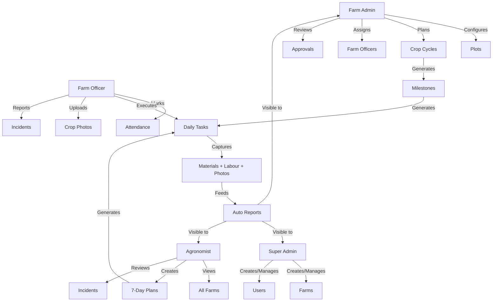

---

## 2. Authentication Flow

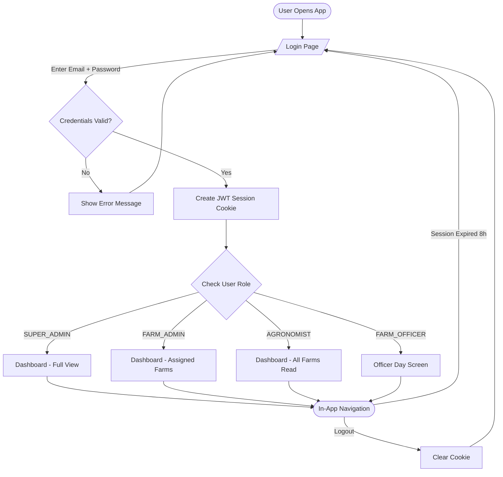

---

## 3. Super Admin: Farm & User Management

### 3.1 Create Farm

```mermaid
flowchart TD
    DASH([Dashboard]) -->|Click "New Farm"| FORM[/Farm Creation Form/]
    FORM -->|Fill Details| FIELDS[Farm Name, Owner, Location\nLat/Long, Area, Water Source]
    FIELDS -->|Submit| VALIDATE{Validation Pass?}
    VALIDATE -->|No| ERRORS[Show Field Errors]
    ERRORS --> FORM
    VALIDATE -->|Yes| CREATE[POST /api/farms]
    CREATE --> STATUS[Farm Created - Status: SETUP]
    STATUS --> HUB[Farm Hub Page]
```

### 3.2 Create User

```mermaid
flowchart TD
    ADMIN([Admin Console]) -->|Click "Add User"| FORM[/User Form/]
    FORM -->|Fill| FIELDS[Name, Email, Password, Role]
    FIELDS -->|Submit| CREATE[POST /api/users]
    CREATE --> ASSIGN{Role = FARM_ADMIN\nor FARM_OFFICER?}
    ASSIGN -->|Yes| ACCESS[Assign Farm Access]
    ASSIGN -->|No| DONE([User Created])
    ACCESS --> DONE
```

---

## 4. Farm Admin: Farm Setup Flow

### 4.1 Complete Farm Setup

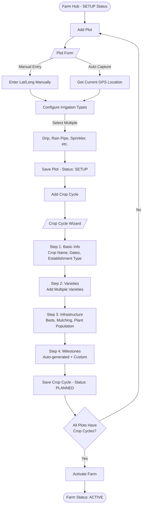

### 4.2 Plot Detail View

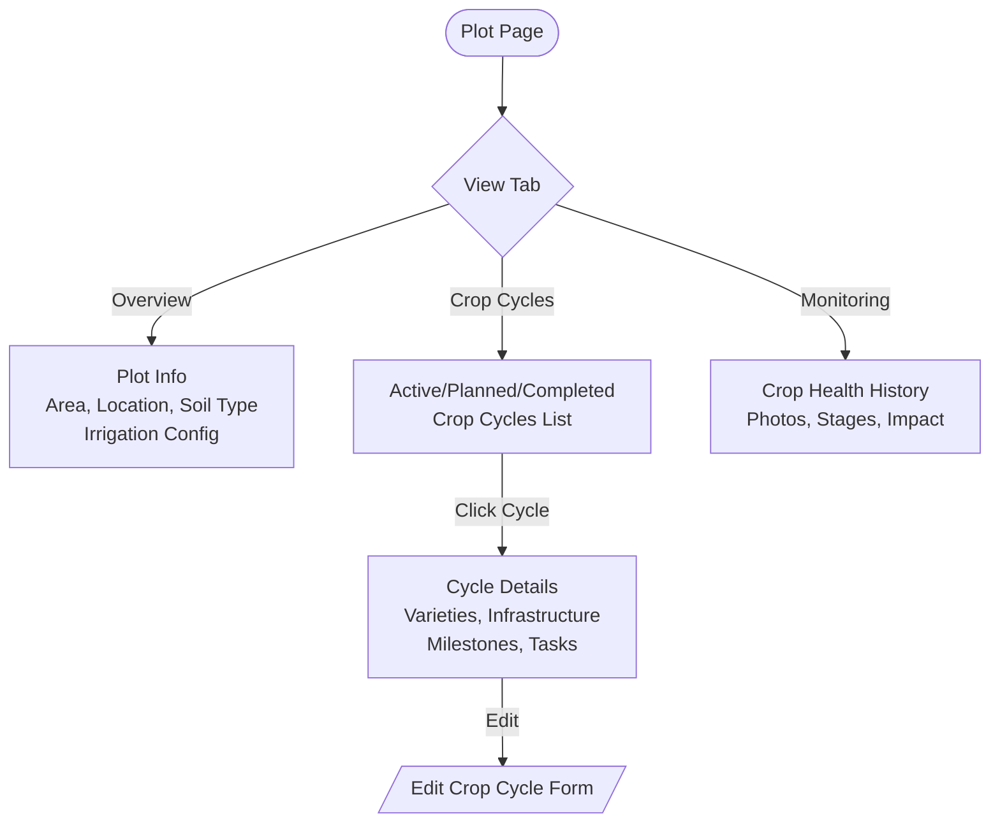

---

## 5. Agronomist: Planning & Monitoring

### 5.1 Dashboard Drill-Down

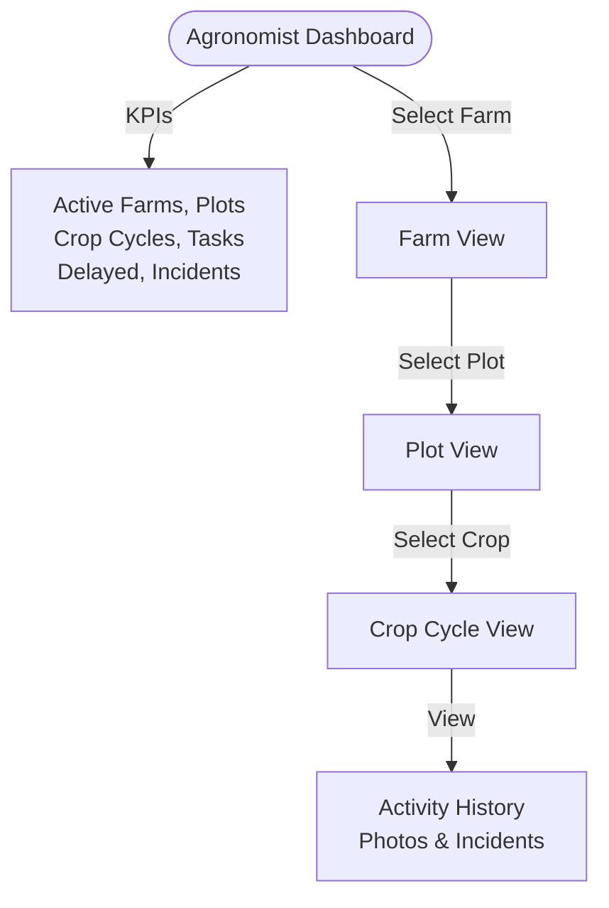

### 5.2 Create 7-Day Agronomy Plan

```mermaid
flowchart TD
    DASH([Dashboard]) -->|Navigate| TASKS[Tasks Page]
    TASKS -->|Click "New Task"| FORM[/Task Creation Form/]
    
    FORM --> SELECT_FARM[Select Farm]
    SELECT_FARM --> SELECT_PLOT[Select Plot]
    SELECT_PLOT --> SELECT_CROP[Select Crop Cycle]
    SELECT_CROP --> WEATHER{Check Weather?}
    
    WEATHER -->|Auto| FETCH[Fetch from Open-Meteo API]
    WEATHER -->|Manual| MANUAL[Enter Temperature, Humidity\nWind, Rain Forecast]
    WEATHER -->|Skip| ACTIVITY
    
    FETCH & MANUAL --> ACTIVITY[Define Activity]
    ACTIVITY --> DETAILS[Category, Title, Description\nInstructions, Priority, Due Date]
    DETAILS --> ASSIGN[Assign Farm Officer]
    ASSIGN --> CREATE[POST /api/tasks]
    CREATE --> NOTIFY([Task Appears in\nOfficer's Daily List])
```

---

## 6. Farm Officer: Daily Execution

### 6.1 Complete Day Flow

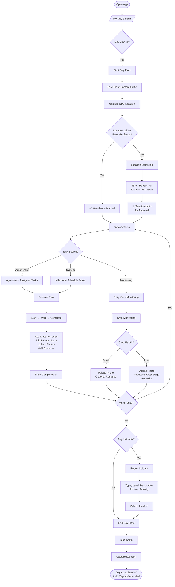

### 6.2 Task Execution Detail

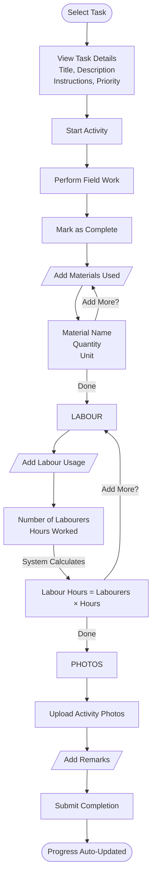

---

## 7. Approval Flows

### 7.1 Attendance Exception

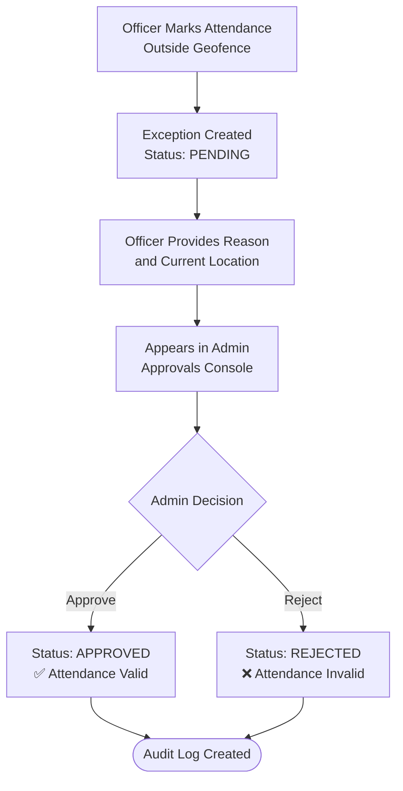

### 7.2 Location Change Request

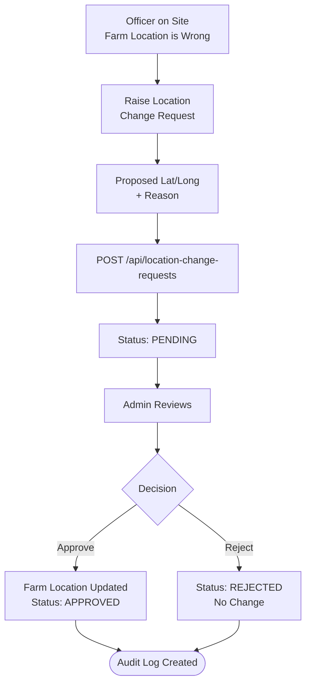

---

## 8. Incident Management Flow

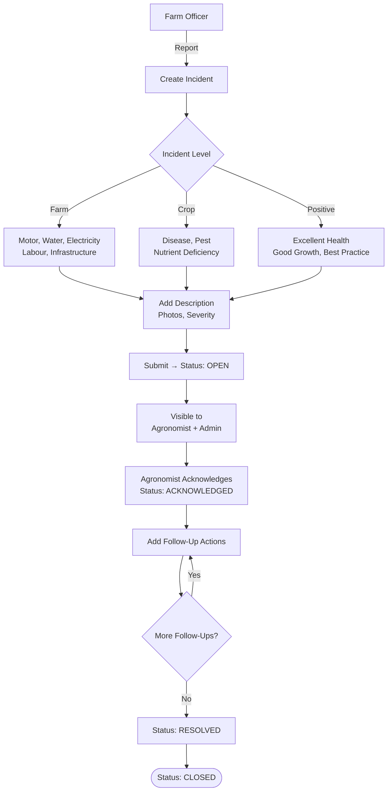

---

## 9. Auto Reporting Flow

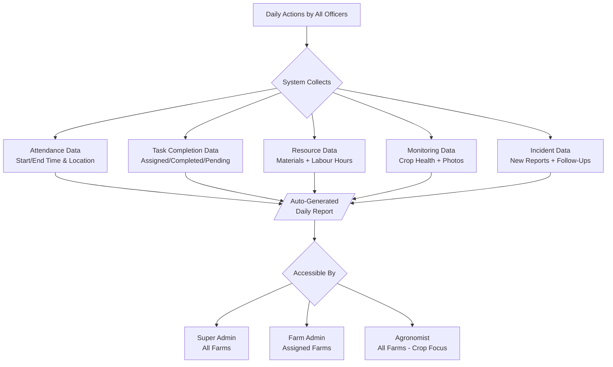

---

## 10. Presence & Geofence Verification Flow

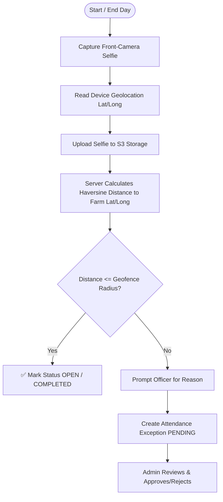

---

## 11. Page Navigation Map

```
/ (Root) → Redirect to /dashboard or /login

/login                              ← All unauthenticated users (Email + Password)
/dashboard                          ← All authenticated users (role-aware)

/farms/new                          ← Super Admin, Farm Admin
/farms/[farmId]                     ← Farm Hub (role-aware)

/plots/[plotId]                     ← Plot Detail
/plots/[plotId]/crop-cycles/new     ← Create Crop Cycle
/plots/[plotId]/crop-cycles/[id]/edit ← Edit Crop Cycle

/tasks                              ← Task Board (all roles, filtered)
/tasks/new                          ← Create Task (Agronomist, Admin)

/officer/day                        ← Farm Officer "My Day"
/officer/reports                    ← Officer Field Reports

/reports/daily                      ← Auto-generated Daily Reports

/admin/users                        ← User Management (Super Admin)
/admin/approvals                    ← Approval Console (Admin)
```
