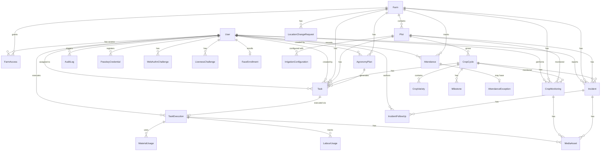

# Agaate Farm Management PWA — Data Model Reference


<!-- cortex:toc -->
- [1. Entity-Relationship Diagram](#1-entity-relationship-diagram)
- [2. Enumerations](#2-enumerations)
  - [2.1 User & Access](#21-user--access)
  - [2.2 Farm & Plot](#22-farm--plot)
  - [2.3 Crop & Agronomy](#23-crop--agronomy)
  - [2.4 Task Workflow](#24-task-workflow)
  - [2.5 Attendance & Approvals](#25-attendance--approvals)
  - [2.6 Monitoring & Incidents](#26-monitoring--incidents)
- [3. Model Specifications](#3-model-specifications)
  - [3.1 User](#31-user)
  - [3.2 Farm](#32-farm)
  - [3.3 FarmAccess](#33-farmaccess)
  - [3.4 Plot](#34-plot)
  - [3.5 CropCycle](#35-cropcycle)
  - [3.6 AgronomyPlan](#36-agronomyplan)
  - [3.7 Task](#37-task)
  - [3.8 TaskExecution](#38-taskexecution)
  - [3.9 Attendance](#39-attendance)
  - [3.10 Biometric Models](#310-biometric-models)
- [4. Key Relationships Summary](#4-key-relationships-summary)
- [5. Business Rules Encoded in Schema](#5-business-rules-encoded-in-schema)
- [6. Seed Data Structure](#6-seed-data-structure)
<!-- cortex:toc:end -->

**Version:** 1.0  
**Date:** 2026-08-30  
**ORM:** Prisma 6.8.2  
**Database:** MySQL 8  
**Schema:** [prisma/schema.prisma](file:///c:/Users/krish/Downloads/agaateapp/prisma/schema.prisma)

---

## 1. Entity-Relationship Diagram



---

## 2. Enumerations

### 2.1 User & Access

```sql
enum Role {
  SUPER_ADMIN      -- Unrestricted platform access
  FARM_ADMIN       -- Manages assigned farms
  AGRONOMIST       -- Central agronomy team, reads all farms
  FARM_OFFICER     -- Field execution role
}
```

### 2.2 Farm & Plot

```sql
enum FarmStatus {
  SETUP            -- Initial creation, plots/crops not configured
  ACTIVE           -- Operational, officers assigned, tasks flowing
  INACTIVE         -- Temporarily paused
  COMPLETED        -- Operations concluded
}

enum PlotStatus {
  SETUP            -- Created but not yet configured
  ACTIVE           -- In use with active crop cycles
  INACTIVE         -- Temporarily unused
  ARCHIVED         -- Soft-deleted, hidden from active views
}
```

### 2.3 Crop & Agronomy

```sql
enum EstablishmentType {
  NURSERY_TRANSPLANTATION    -- Seedlings transplanted from nursery
  DIRECT_SOWING              -- Seeds sown directly in field
}

enum CropCycleStatus {
  PLANNED          -- Configured, not yet started
  ACTIVE           -- Currently growing
  COMPLETED        -- Harvest completed
  CANCELLED        -- Cancelled before completion
}

enum MilestoneStatus {
  PENDING          -- Not yet started
  IN_PROGRESS      -- Work underway
  COMPLETED        -- Achieved
  SKIPPED          -- Intentionally bypassed
}
```

### 2.4 Task Workflow

```sql
enum TaskOrigin {
  AGRONOMIST           -- Created by agronomist in 7-day plan
  SYSTEM               -- Auto-generated from milestones/schedules
  DAILY_MONITORING     -- Daily crop monitoring tasks
}

enum TaskStatus {
  DRAFT            -- Created but not yet assigned
  ASSIGNED         -- Assigned to specific officer
  AVAILABLE        -- Available for any officer to pick up
  IN_PROGRESS      -- Officer has started work
  COMPLETED        -- Work finished, evidence captured
  CANCELLED        -- Cancelled before completion
  BLOCKED          -- Cannot proceed (dependency/issue)
}
```

**Task State Machine:**

```
DRAFT ──→ ASSIGNED ──→ IN_PROGRESS ──→ COMPLETED
  │          │               │
  ├──→ AVAILABLE ──→ IN_PROGRESS
  │                        │
  └──→ CANCELLED    BLOCKED ──→ IN_PROGRESS
                      │
                      └──→ CANCELLED
```

### 2.5 Attendance & Approvals

```sql
enum AttendanceStatus {
  OPEN                   -- Day started, not yet ended
  COMPLETED              -- Day ended normally
  EXCEPTION_PENDING      -- Location mismatch, awaiting approval
  EXCEPTION_APPROVED     -- Exception approved by admin
  EXCEPTION_REJECTED     -- Exception rejected by admin
}

enum ApprovalStatus {
  PENDING          -- Awaiting review
  APPROVED         -- Approved by authorized user
  REJECTED         -- Rejected by authorized user
}
```

### 2.6 Monitoring & Incidents

```sql
enum HealthStatus {
  GOOD             -- Crop is healthy
  POOR             -- Crop showing problems
}

enum IncidentLevel {
  FARM             -- Farm-wide issue (motor, water, electricity)
  PLOT             -- Plot-specific issue
  CROP             -- Crop-specific issue (disease, pest)
}

enum IncidentStatus {
  OPEN             -- Newly reported
  ACKNOWLEDGED     -- Agronomist/Admin has seen it
  RESOLVED         -- Issue addressed
  CLOSED           -- Fully resolved and closed
}

enum MediaKind {
  SELFIE               -- Attendance selfie
  CROP_PHOTO           -- Daily crop monitoring photo
  INCIDENT_PHOTO       -- Incident evidence photo
  ACTIVITY_EVIDENCE    -- Task completion evidence
}
```

---

## 3. Model Specifications

### 3.1 User

```prisma
model User {
  id              String    @id @default(cuid())
  name            String
  email           String    @unique
  passwordHash    String
  role            Role
  active          Boolean   @default(true)
  createdAt       DateTime  @default(now())
  updatedAt       DateTime  @updatedAt

  // Relations
  farmAccess          FarmAccess[]
  assignedTasks       Task[]              @relation("AssignedOfficer")
  createdTasks        Task[]              @relation("TaskCreator")
  createdPlans        AgronomyPlan[]      @relation("PlanCreator")
  executions          TaskExecution[]
  attendance          Attendance[]
  monitoring          CropMonitoring[]
  reportedIncidents   Incident[]          @relation("IncidentReporter")
  incidentFollowUps   IncidentFollowUp[]  @relation("FollowUpAuthor")
  auditLogs           AuditLog[]          @relation("AuditActor")
  passkeys            PasskeyCredential[]
  faceEnrollment      FaceEnrollment?
  webauthnChallenges  WebAuthnChallenge[]
  livenessChallenges  LivenessChallenge[]
}
```

**Notes:**
- `email` is the unique login identifier
- `passwordHash` uses bcrypt with 12 salt rounds
- `active` flag enables soft-disable without deletion
- `role` determines RBAC permissions globally

---

### 3.2 Farm

```prisma
model Farm {
  id                    String      @id @default(cuid())
  name                  String
  ownerName             String
  location              String
  address               String?
  latitude              Decimal     @db.Decimal(10, 7)
  longitude             Decimal     @db.Decimal(10, 7)
  totalArea             Decimal     @db.Decimal(12, 2)
  cultivableArea        Decimal     @db.Decimal(12, 2)
  waterSource           String
  status                FarmStatus  @default(SETUP)
  geofenceRadiusMeters  Int         @default(500)
  createdAt             DateTime    @default(now())
  updatedAt             DateTime    @updatedAt
}
```

**Notes:**
- `geofenceRadiusMeters` used for attendance location matching (Haversine formula)
- `totalArea` and `cultivableArea` in acres
- Coordinates stored with 7 decimal places (~1cm precision)

---

### 3.3 FarmAccess

```prisma
model FarmAccess {
  id        String   @id @default(cuid())
  userId    String
  farmId    String
  canManage Boolean  @default(false)
  createdAt DateTime @default(now())

  @@unique([userId, farmId])
  @@index([farmId])
}
```

**Notes:**
- M:N junction table between User and Farm
- `canManage = true` for Farm Admins (write access)
- `canManage = false` for Farm Officers (execute access)
- SUPER_ADMIN and AGRONOMIST bypass this table entirely (platform-wide access)

---

### 3.4 Plot

```prisma
model Plot {
  id        String      @id @default(cuid())
  farmId    String
  name      String
  area      Decimal     @db.Decimal(12, 2)
  latitude  Decimal     @db.Decimal(10, 7)
  longitude Decimal     @db.Decimal(10, 7)
  soilType  String?
  status    PlotStatus  @default(SETUP)
  deletedAt DateTime?
  createdAt DateTime    @default(now())
  updatedAt DateTime    @updatedAt

  @@unique([farmId, name])
  @@index([farmId, status])
}
```

**Notes:**
- `deletedAt` enables soft deletion (ARCHIVED status)
- Plot names must be unique within a farm
- Area in acres, used for infrastructure calculations

---

### 3.5 CropCycle

```prisma
model CropCycle {
  id                       String            @id @default(cuid())
  plotId                   String
  cropName                 String
  startDate                DateTime          @db.Date
  expectedFirstHarvestDate DateTime?         @db.Date
  establishmentType        EstablishmentType
  status                   CropCycleStatus   @default(PLANNED)

  // Infrastructure - Bed Preparation
  bedPreparationEnabled    Boolean           @default(false)
  bedWidthCm               Decimal?          @db.Decimal(8, 2)
  bedCenterDistanceCm      Decimal?          @db.Decimal(8, 2)
  expectedBedsPerAcre      Decimal?          @db.Decimal(12, 2)
  expectedTotalBeds        Decimal?          @db.Decimal(12, 2)
  actualBedsCreated        Decimal?          @db.Decimal(12, 2)

  // Infrastructure - Mulching
  mulchEnabled             Boolean           @default(false)
  mulchHolePattern         String?
  plantDistanceCm          Decimal?          @db.Decimal(8, 2)

  // Infrastructure - Plant Population
  expectedPlantsPerAcre    Decimal?          @db.Decimal(12, 2)
  expectedPlants           Decimal?          @db.Decimal(12, 2)
  actualPlants             Decimal?          @db.Decimal(12, 2)

  createdAt                DateTime          @default(now())
  updatedAt                DateTime          @updatedAt

  @@index([plotId, status])
}
```

**Auto-Calculations (business.ts):**
- `expectedTotalBeds = expectedBedsPerAcre × plot.area`
- `expectedPlants = expectedPlantsPerAcre × plot.area`
- `variance = actual - expected` (with percentage)

---

### 3.6 AgronomyPlan

```prisma
model AgronomyPlan {
  id                    String    @id @default(cuid())
  farmId                String
  planDate              DateTime  @db.Date
  notes                 String?

  // Manual weather data (alternative to API fetch)
  manualTemperature     Decimal?  @db.Decimal(5, 2)
  manualHumidity        Decimal?  @db.Decimal(5, 2)
  manualWindSpeed       Decimal?  @db.Decimal(5, 2)
  manualRainForecast    Decimal?  @db.Decimal(5, 2)
  manualWeatherRemarks  String?

  createdById           String
  createdAt             DateTime  @default(now())
  updatedAt             DateTime  @updatedAt @default(now())

  @@unique([farmId, planDate])
}
```

**Notes:**
- One plan per farm per day (upsert pattern)
- Weather data can come from API (Open-Meteo) or manual entry
- Tasks are linked to plans via `Task.planId`

---

### 3.7 Task

```prisma
model Task {
  id                String      @id @default(cuid())
  farmId            String
  plotId            String?
  cropCycleId       String?
  milestoneId       String?
  planId            String?
  origin            TaskOrigin
  category          String
  title             String
  description       String
  instructions      String?
  priority          String      @default("MEDIUM")
  dueDate           DateTime    @db.Date
  status            TaskStatus  @default(DRAFT)
  assignedOfficerId String?
  createdById       String
  createdAt         DateTime    @default(now())
  updatedAt         DateTime    @updatedAt

  @@index([assignedOfficerId, dueDate, status])
  @@index([farmId, dueDate])
}
```

**Notes:**
- `origin` tracks how the task was created (Agronomist, System, or Monitoring)
- `category` examples: "FERTILIZATION", "CROP_PROTECTION", "CULTURAL_PRACTICES"
- `priority` values: "LOW", "MEDIUM", "HIGH", "CRITICAL"
- Status transitions enforced by `canTransitionTask()` in business.ts

---

### 3.8 TaskExecution

```prisma
model TaskExecution {
  id          String      @id @default(cuid())
  taskId      String      @unique
  officerId   String
  status      TaskStatus
  startedAt   DateTime?
  completedAt DateTime?
  remarks     String?
}
```

**Notes:**
- One execution per task (1:1 via `@unique taskId`)
- Links to `MaterialUsage[]`, `LabourUsage[]`, `MediaAsset[]`

---

### 3.9 Attendance

```prisma
model Attendance {
  id                    String            @id @default(cuid())
  userId                String
  farmId                String
  attendanceDate        DateTime          @db.Date
  status                AttendanceStatus  @default(OPEN)
  startAt               DateTime?
  endAt                 DateTime?
  startLatitude         Decimal?          @db.Decimal(10, 7)
  startLongitude        Decimal?          @db.Decimal(10, 7)
  endLatitude           Decimal?          @db.Decimal(10, 7)
  endLongitude          Decimal?          @db.Decimal(10, 7)
  startSelfieKey        String?
  endSelfieKey          String?
  exceptionReason       String?

  // Biometric verification flags
  webauthnVerified      Boolean           @default(false)
  webauthnCredentialId  String?
  faceVerified          Boolean           @default(false)
  faceDistance           Decimal?          @db.Decimal(6, 3)
  faceSimilarityPercent Int?
  faceModelId           String?
  faceThresholdVersion  String?
  livenessVerified      Boolean           @default(false)
  livenessChallengeId   String?

  @@unique([userId, farmId, attendanceDate])
}
```

**Notes:**
- One attendance record per user per farm per day
- Biometric fields track which verification methods were used
- `faceDistance` is cosine distance, `faceSimilarityPercent` is human-readable

---

### 3.10 Biometric Models

```prisma
model FaceEnrollment {
  id                  String    @id @default(cuid())
  userId              String    @unique
  modelId             String              -- e.g., "face-api-vladmandic"
  modelVersion        String              -- e.g., "0.2.0"
  thresholdVersion    String?             -- threshold calibration version
  encryptedEmbedding  String              -- AES-256-GCM encrypted
  iv                  String              -- Initialization vector
  authTag             String              -- GCM auth tag
  status              String    @default("ACTIVE")
  consentGivenAt      DateTime
  consentIp           String?
  enrollmentCount     Int
  qualityScore        Decimal?  @db.Decimal(5, 2)
}

model PasskeyCredential {
  id            String    @id @default(cuid())
  userId        String
  credentialId  String    @unique
  publicKey     String
  counter       BigInt    @default(0)
  transports    String?
  deviceType    String?
  backedUp      Boolean   @default(false)
  name          String?
  revokedAt     DateTime?

  @@index([userId])
}

model LivenessChallenge {
  id          String    @id @default(cuid())
  userId      String
  challenge   String    @unique
  instruction String               -- e.g., "smile", "blink", "turn_left"
  expiresAt   DateTime
  used        Boolean   @default(false)

  @@index([userId, used])
  @@index([expiresAt])
}
```

---

## 4. Key Relationships Summary

```
User ←M:N→ Farm          via FarmAccess (canManage flag)
Farm ←1:N→ Plot
Plot ←1:N→ CropCycle
Plot ←1:N→ IrrigationConfiguration
CropCycle ←1:N→ CropVariety
CropCycle ←1:N→ Milestone
Farm ←1:N→ AgronomyPlan
AgronomyPlan ←1:N→ Task
Task ←1:1→ TaskExecution
TaskExecution ←1:N→ MaterialUsage
TaskExecution ←1:N→ LabourUsage
TaskExecution ←1:N→ MediaAsset
CropMonitoring ←1:N→ MediaAsset
Incident ←1:N→ MediaAsset
Incident ←1:N→ IncidentFollowUp
Attendance ←1:1→ AttendanceException
User ←1:1→ FaceEnrollment
User ←1:N→ PasskeyCredential
```

---

## 5. Business Rules Encoded in Schema

| Rule | Implementation |
|---|---|
| One attendance per user per farm per day | `@@unique([userId, farmId, attendanceDate])` |
| Unique plot names within a farm | `@@unique([farmId, name])` |
| One agronomy plan per farm per day | `@@unique([farmId, planDate])` |
| One execution per task | `taskId String @unique` on TaskExecution |
| No duplicate farm access | `@@unique([userId, farmId])` on FarmAccess |
| No duplicate irrigation type per plot | `@@unique([plotId, type])` |
| No duplicate variety name per cycle | `@@unique([cropCycleId, name])` |
| Soft delete for plots | `deletedAt DateTime?` field |
| Passkey revocation | `revokedAt DateTime?` field |
| Cascading deletes | `onDelete: Cascade` on child references |

---

## 6. Seed Data Structure

The seed script (`prisma/seed.ts`) creates:

| Entity | Count | Details |
|---|---|---|
| Users | 4+ | Super Admin, Farm Admin, Agronomist, Farm Officer |
| Farms | 2+ | With complete details and coordinates |
| Farm Access | 4+ | Role-appropriate access grants |
| Plots | 4+ | With irrigation configurations |
| Crop Cycles | 2+ | With varieties and milestones |
| Tasks | Multiple | From different origins |
| Attendance | Sample | With biometric data |
| Incidents | Sample | Farm and crop level |

**Default Credentials:**
- Email: `admin@agaate.local`
- Password: `LocalAdminPassword-ChangeMe-123` (or `INITIAL_ADMIN_PASSWORD` env var)
