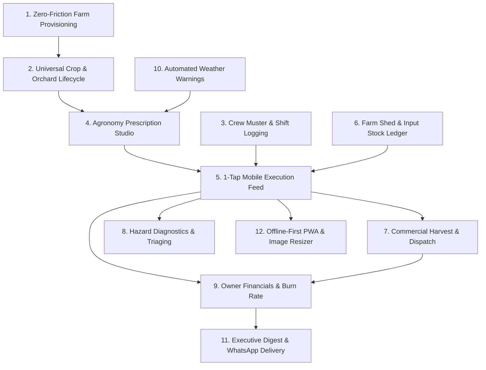

# Agaate Farm Management Platform — Master System Architecture & Full Application Design

**Version:** 2.0  
**Author:** Agaate Product & System Architecture Group  
**Status:** Canonical System Design Blueprint

---

## 1. Executive Summary & The Four Authorities

Agaate is a B2B Precision Agrotechnology and Managed Farm Operations platform. The platform connects central agricultural science with on-the-ground estate execution, giving landowners total operational and commercial transparency.

### The Real-World Hierarchy

```
┌──────────────────────────────────────────────────────────────────────────┐
│                          SUPER ADMIN (AGAATE HQ)                         │
│  The Master Operator: Onboards clients, provisions farms, assigns         │
│  central agronomists, monitors platform-wide agricultural health & SLA.  │
└─────────────────────┬──────────────────────────────┬─────────────────────┘
                      │ Provisions Farm & Access     │ Assigns Dedicated Agronomist
                      ▼                              ▼
┌──────────────────────────────────────────┐   ┌───────────────────────────┐
│       FARM ADMIN (CLIENT / OWNER)        │   │     CENTRAL AGRONOMIST    │
│  The Farm Owner / Investor / Landowner.  │   │  Agaate's Crop Doctor.    │
│  Owns the land, finances operations,     │   │  Remote crop specialist   │
│  hires local farm managers, and needs    │   │  serving multiple farms.  │
│  full visibility over yield, burn rate,  │   │  Diagnoses pest photos,   │
│  labour, and asset health.               │   │  issues weekly recipes    │
└─────────────────────┬────────────────────┘   │  and spray prescriptions. │
                      │ Employs & Directs      └─────────────┬─────────────┘
                      ▼                                      │ Prescribes Work
┌────────────────────────────────────────────────────────────┴─────────────┐
│                       FARM OFFICER (FARM MANAGER)                        │
│  The Physical On-Site Supervisor: Employed by the Farm Owner.            │
│  Leads field labour crews, operates valves/pumps, executes agronomy      │
│  prescriptions, logs daily inputs & harvest, snaps photos of problems.   │
└─────────────────────────────────────┬────────────────────────────────────┘
                                      │ Supervises & Coordinates
                                      ▼
┌──────────────────────────────────────────────────────────────────────────┐
│                   FIELD LABOUR CREWS & APMC BUYERS                       │
│  Daily wage workers, spray operators, harvest picking crews, traders.    │
└──────────────────────────────────────────────────────────────────────────┘
```

---

## 2. Comprehensive Role Personas & Daily Lifecycle

### 2.1 Super Admin (Agaate Operations Directorate)
- **Who they are**: Agaate core team (Operations Director, Lead Agronomist, Platform Manager).
- **Primary Goal**: Rapid client onboarding, agronomist allocation, cross-farm operational quality control, platform SLA monitoring.
- **Mental Model**: "A new client signed up for our 20-acre estate management plan. In 2 minutes, I create their farm, configure their base plots, generate the owner credentials, assign Dr. Rao as their dedicated agronomist, and track that our agronomy recommendations are executed on time."

### 2.2 Farm Admin (The Client / Farm Owner)
- **Who they are**: High-net-worth individual, corporate farm owner, NRI investor, or progressive farmer. Often living in an urban center away from the farm.
- **Primary Goal**: Complete operational truth, ROI protection, asset security, and crop success.
- **Mental Model**: "I invested money in this farmland. Are my workers on site? Is the drip irrigation running? What is the agronomist recommending? How many crates of capsicum were harvested today? How much did I spend on labour and fertilizer this week? I don't want to micromanage every valve, but I want total visual and financial transparency."

### 2.3 Central Agronomist (Agaate Crop Specialist)
- **Who they are**: Master's/Ph.D. in Agronomy / Plant Pathology / Soil Science working centrally for Agaate.
- **Primary Goal**: Maximizing yield per acre, preventing disease outbreaks, optimizing nutrient efficiency.
- **Mental Model**: "I oversee 15 client farms. Every morning I check weather radar for heat stress or rain forecast. I review crop growth stages across all plots. When an on-site manager uploads a photo of leaf blight, I diagnose it on my workbench, prescribe an exact tank-mix recipe, and send a high-priority work order directly to the manager's mobile app."

### 2.4 Farm Officer (On-Site Farm Manager / Field Supervisor)
- **Who they are**: Diploma in Agriculture or experienced local agricultural supervisor living on or near the farm. Employed by the Farm Owner.
- **Primary Goal**: Practical, friction-free daily execution, directing labour crews, keeping machinery running, satisfying the owner.
- **Mental Model**: "It's 7:00 AM and sunny. I have 8 daily-wage labourers waiting at the gate. I need to open the app, log crew headcount, check what spray the agronomist ordered, turn on the fertigation venturi, and log 40 crates harvested yesterday. I have mud on my hands and spotty 3G internet; I need 1-tap buttons, quick camera capture, and zero complicated forms."

---

## 3. Complete Page & Screen Inventory Across All 4 Roles

```
┌────────────────────────────────────────────────────────────────────────────────────────┐
│                               MASTER PAGE MATRIX (24 SCREENS)                          │
├───────────────────────────────┬───────────────────────────────┬────────────────────────┤
│ ROLE                          │ ROUTE                         │ SURFACE PURPOSE        │
├───────────────────────────────┼───────────────────────────────┼────────────────────────┤
│ Super Admin                   │ /admin/estates                │ Multi-farm directory   │
│ Super Admin                   │ /admin/estates/new            │ 1-step farm creation   │
│ Super Admin                   │ /admin/clients                │ Client owner accounts  │
│ Super Admin                   │ /admin/agronomists            │ Specialist assignments │
│ Super Admin                   │ /admin/governance             │ Audit & system logs    │
├───────────────────────────────┼───────────────────────────────┼────────────────────────┤
│ Farm Admin (Owner)            │ /owner/dashboard              │ Executive command deck │
│ Farm Admin (Owner)            │ /owner/plots                  │ Estate visual parcel map│
│ Farm Admin (Owner)            │ /owner/plots/[plotId]         │ Single parcel timeline │
│ Farm Admin (Owner)            │ /owner/crops/new              │ Flexible crop wizard   │
│ Farm Admin (Owner)            │ /owner/harvest                │ Commercial sales ledger│
│ Farm Admin (Owner)            │ /owner/financials             │ Operational burn rate  │
│ Farm Admin (Owner)            │ /owner/inventory              │ Shed input stock       │
│ Farm Admin (Owner)            │ /owner/team                   │ Farm staff management  │
│ Farm Admin (Owner)            │ /owner/reports                │ 1-click PDF/WhatsApp   │
├───────────────────────────────┼───────────────────────────────┼────────────────────────┤
│ Central Agronomist            │ /agronomy/radar               │ Cross-farm crop matrix │
│ Central Agronomist            │ /agronomy/prescriptions/new   │ Precision recipe studio│
│ Central Agronomist            │ /agronomy/diagnostics         │ Pest photo desk        │
│ Central Agronomist            │ /agronomy/library             │ SOP & chemical handbook│
├───────────────────────────────┼───────────────────────────────┼────────────────────────┤
│ Farm Officer (Mobile)         │ /officer/today                │ 1-tap daily work feed  │
│ Farm Officer (Mobile)         │ /officer/quick-log            │ 10-second field logger │
│ Farm Officer (Mobile)         │ /officer/harvest              │ Crate & weighbridge log│
│ Farm Officer (Mobile)         │ /officer/crew                 │ Daily labour muster    │
│ Farm Officer (Mobile)         │ /officer/shed                 │ -Stock out consumption │
│ Farm Officer (Mobile)         │ /officer/hazard               │ Express problem snap   │
└───────────────────────────────┴───────────────────────────────┴────────────────────────┘
```

---

## 4. Deep-Dive Specification of Each Role's User Interface

### 4.1 Super Admin Surfaces (Agaate Operations HQ)

#### 1. `/admin/estates` (Global Estates Directory)
- **Top Metrics**: Total Managed Estates, Total Cultivable Acreage, Active Crop Cycles, Open Pathogen Alerts.
- **Estates Table**:
  - Farm Name & Code (e.g. `AGA-HSR-01`)
  - Client / Owner Name with direct phone/WhatsApp action
  - Location & Micro-Region
  - Assigned Agronomist (with quick reassign dropdown)
  - On-Site Manager Name
  - Operational Status: `ONBOARDING`, `ACTIVE`, `HARVESTING`, `PAUSED`
  - Health Score: Green (Nominal), Amber (Pest/Issue Flagged), Red (Critical Hazard)
- **Actions**: "Provision New Estate", "Filter by Region", "Export Agronomy Summary".

#### 2. `/admin/estates/new` (1-Step Client Farm Provisioning)
- **Design Principle**: Zero-friction onboarding. Complete in under 90 seconds.
- **Form Fields**:
  - **Client Details**: Client Name, Phone/WhatsApp, Email (auto-generates owner account).
  - **Estate Details**: Farm Name, District, State, Total Acreage.
  - **Agronomy Lead**: Select from active Agaate Agronomists.
  - **Initial Manager**: Name & Mobile of on-site farm officer (optional, can be invited later).
- **System Action upon Submit**:
  - Creates `Farm` in `ACTIVE` status immediately.
  - Creates `User` with `FARM_ADMIN` role and links via `FarmAccess`.
  - Sends SMS/WhatsApp invite with temporary password and login link.

#### 3. `/admin/clients` (Client Account Directorate)
- Complete directory of client owners, linked properties, contract renewal dates, service tier (e.g. *Full Farm Management*, *Agronomy Advisory Only*, *Tech Platform Only*).

#### 4. `/admin/agronomists` (Specialist Workload & SLA Console)
- Displays each Agaate Agronomist, assigned farm count, diagnostic response time (hours between officer photo upload and prescription issued), and scheduled visits.

---

### 4.2 Farm Admin Surfaces (Client / Farm Owner Cockpit)

#### 1. `/owner/dashboard` (Executive Orientation Cockpit)
- **Header**: Greeting, estate name, current weather badge (temperature, humidity, rain alert), emergency contact for assigned Agronomist.
- **Live Field Muster Widget**:
  - "On Duty Today: Farm Manager Ramesh + 7 Field Labourers."
  - Clock-in timestamp and informational location stamp.
- **Operations Pulse Progress**:
  - Visual circular/horizontal bar: e.g., "3 of 4 scheduled operations completed today."
  - Next operation: "Drip fertigation Plot 2 at 3:00 PM."
- **Live Field Visual Stream**:
  - Horizontal carousel of the latest 8 photos taken across plots by the manager today. Click to zoom in high-res.
- **Commercial & Yield Snapshot**:
  - Harvest this week: e.g. "420 Crates (8,400 kg) &bull; Est. Value ₹2,10,000".
- **Action Items & Alerts**:
  - Prominent banner if an incident requires owner attention (e.g. "Borewell Pump Capacitor Replaced &bull; Cost ₹4,500").

#### 2. `/owner/plots` (Estate Parcel Map & Crop Explorer)
- Interactive visual grid of all land plots.
- For each Plot card:
  - Plot Name & Area (e.g., "Plot 1 - North Polyhouse &bull; 4.5 Acres")
  - Current Crop & Variety (e.g., "Bell Pepper (Indra Red F1)")
  - Phenological Stage badge: `VEGETATIVE`, `FLOWERING`, `FRUITING`, `HARVESTING`
  - Days since planting: "Day 42 of 120"
  - Quick Telemetry: Last irrigated yesterday, next spray tomorrow.

#### 3. `/owner/plots/[plotId]` (Single Parcel Deep-Dive & Timeline)
- Detailed operational ledger for a specific plot:
  - Cumulative yield to date (kg/acre)
  - Total inputs applied (Fertilizers & Crop Protection history)
  - Timeline of all field photos taken over the last 90 days
  - Soil test parameters (pH, EC, Organic Carbon)

#### 4. `/owner/crops/new` (Universal Planting Setup Wizard)
- Flexible wizard supporting:
  - **Short-Cycle Vegetables**: Start date, duration, optional bed layout.
  - **Perennial Orchards**: Tree count, plant spacing, planting year, active flush stage.
  - **Greenhouse / Hydroponic**: Bench count, substrate type.
- **No artificial milestones required**: Milestones can be added flexibly or auto-populated based on crop templates.

#### 5. `/owner/harvest` (Commercial Harvest Ledger)
- High-level commercial scoreboard: Total kilograms harvested, grade breakdown (Grade A / Grade B / Culls), crates dispatched, buyers, and estimated revenue.
- Filterable by date range, plot, and crop variety.
- 1-click CSV/Excel export for accountant records.

#### 6. `/owner/financials` (Farm Burn Rate & Operating Costs)
- Categorized expense breakdown:
  - Labour Wages (computed from crew headcount & wage rates)
  - Agri-Inputs (fertilizers, pesticides, seeds purchased)
  - Machinery & Diesel (tractor hours, pump fuel, generator maintenance)
  - Infrastructure Repairs & Spares
  - Electricity & Water Bills
- Monthly Burn Trend chart: Month-to-Date spend vs Harvest Revenue.

#### 7. `/owner/inventory` (Tool Shed & Chemical Stock)
- Real-time balances of farm inputs:
  - Item name, category (Fertilizer, Pesticide, Spares, Seeds)
  - Current quantity in stock (e.g. "14 Bags 19:19:19", "3.5 Liters Neem Oil")
  - Reorder warning marker when stock drops below threshold.

#### 8. `/owner/reports` (Executive Briefings Generator)
- Auto-generates clean, professional **1-Page Farm Executive Briefings** (PDF or WhatsApp text summary) with photos, work done, labour paid, and yield harvested.

---

### 4.3 Central Agronomist Surfaces (Agaate Crop Specialist)

#### 1. `/agronomy/radar` (Multi-Estate Crop Telemetry)
- Comprehensive multi-estate matrix:
  - Columns: Client Estate, Plot, Crop & Variety, Current Stage, Days After Sowing, Health Status, Next Scheduled Treatment.
  - Color-coded health markers: Green (thriving), Yellow (monitoring), Red (active pathogen/stress).

#### 2. `/agronomy/prescriptions/new` (Precision Recipe Studio)
- Agronomist creates a work order for a specific farm plot:
  - **Treatment Type**: Fertigation, Foliar Spray, Bio-Drenching, Pruning, Weed Control.
  - **Target Pest / Nutritional Objective**: e.g., "Downy Mildew Control & Canopy Hardening".
  - **Recipe Formulation**:
    - Product name & chemical composition (e.g. *Metalaxyl 8% + Mancozeb 64% WP*)
    - Dosage per Acre (e.g. *2.5 g / Litre*)
    - Water Volume (e.g. *200 Litres total per acre*)
    - Application Timing (e.g. *Early Morning before 09:00 AM*)
    - Personal Protective Equipment (PPE) warning
  - **Dispatch**: Instantly pushes to the on-site manager's mobile feed.

#### 3. `/agronomy/diagnostics` (Field Hazard & Pest Photo Desk)
- Queue of incoming crop health photos flagged by on-site managers.
- Large inspection viewer with zoom capability.
- Agronomist diagnostic tools:
  - Disease/Pest tagging (e.g. *Thrips tabaci*, *Early Blight*, *Nitrogen Deficiency*)
  - Confidence rating
  - 1-click action: **"Convert to Prescription"** (auto-fills recommended remedy recipe and dispatches work order).

#### 4. `/agronomy/library` (Standard Recipes & Chemical Compatibility)
- Agaate standard operating handbook: crop schedules, fertilizer compatibility charts (which chemicals can be mixed together in the same tank), and safety withholding periods.

---

### 4.4 Farm Officer Surfaces (On-Site Manager — 100% Mobile Feed)

#### 1. `/officer/today` (High-Speed Operational Feed)
- **Top Quick Header**:
  - Big green button: "Myself + [ 8 ] Labourers On Duty" (tap to update headcount).
- **Today's Action Feed**:
  - High-priority agronomist prescriptions at top with big colored icons.
  - Card elements: Title, Plot Name, Big "START" and "DONE" buttons.
  - Tap "DONE" &rarr; opens quick bottom sheet: Confirm recipe dosage &rarr; optional photo snap &rarr; Done in 5 seconds.

#### 2. `/officer/quick-log` (10-Second Express Logger)
- Icon-based grid for un-scheduled routine tasks:
  - 💧 **Irrigation**: Pick Plot &rarr; Enter runtime (e.g., "2 hours") &rarr; Save.
  - 🌿 **Weeding**: Pick Plot &rarr; Labourers used &rarr; Save.
  - 🚜 **Tractor / Land Work**: Pick Plot &rarr; Hours &rarr; Save.
  - 🛠️ **Machinery Repair**: Enter details & cost &rarr; Save.

#### 3. `/officer/harvest` (Crate & Yield Logger)
- Mobile harvest logging:
  - Select Plot & Crop
  - Number of Crates or Total Kilograms
  - Quality Grade: [ Grade A ] [ Grade B ] [ Processing / Rejects ]
  - Vehicle / Buyer Name (e.g. "Trader truck KA-04-E-5512")
  - Quick camera photo of the loaded vehicle/crates.

#### 4. `/officer/crew` (Daily Labour Muster)
- Simple daily headcount:
  - Number of Male workers, Number of Female workers
  - Daily wage rate (e.g. ₹450 / day)
  - Contractor / Gang leader name
  - Automatically calculates daily wage liability for the farm owner.

#### 5. `/officer/shed` (Stock-Out Logger)
- When taking materials from the farm shed:
  - Select item: e.g. "NPK 19:19:19"
  - Tap quantity: "-2 Bags"
  - Automatically keeps warehouse balances up to date.

#### 6. `/officer/hazard` (Instant Hazard Snapper)
- Direct camera trigger.
- Snaps broken pipe, pest leaf damage, or electrical fault.
- Option to speak a 10-second voice note or type 1 sentence.
- Instantly alerts Farm Owner and Agronomist.

---

## 5. Twelve Core Operational Modules



1. **Zero-Friction Client Farm Provisioning**: Rapid setup without activation gatekeepers or mandatory milestones.
2. **Universal Crop & Orchard Lifecycle**: Handles annual vegetables, multi-year fruit orchards, and greenhouses seamlessly.
3. **Crew Muster & High-Trust Presence**: Pragmatic attendance and contractor labour headcounts without hostile geofence lockouts.
4. **Agronomy Prescription Studio**: High-precision recipe generator translating agronomy science into field work orders.
5. **1-Tap Mobile Execution Feed**: Outdoor-friendly, sunlight-readable operational feed for on-site supervisors.
6. **Farm Shed & Input Stock Ledger**: Full track of fertilizers, chemicals, and spares with automated deduction on task completion.
7. **Commercial Harvest & Dispatch Ledger**: The vital business engine recording daily crates, kilograms, grades, and buyer dispatches.
8. **Hazard Diagnostics & Triaging Loop**: Instant camera snap &rarr; Agronomist desktop triage &rarr; 1-click remedy work order.
9. **Owner Financials & Operational Burn Rate**: Transparent visibility over labour costs, diesel, electricity, and inputs vs revenue.
10. **Automated Weather & Microclimate Warnings**: Integrates localized forecast for spray planning, frost warning, and heatwave mitigation.
11. **Executive Digest & WhatsApp Delivery**: 1-page visual summaries delivered directly to absentee farm owners.
12. **Offline-First PWA & Image Resizer**: Client-side image downscaling (under 300KB) and offline action queuing for remote rural areas.

---

## 6. Twenty Real-World Field Edge Cases & Defensive Engineering

1. **Rural 2G/3G Cellular Disconnections**: App caches forms and actions in `IndexedDB`. Photos downscale to 1200px before upload. Actions retry silently in the background.
2. **Multi-Year Fruit Orchards (Mango, Citrus, Pomegranate, Grapes)**: Trees do not undergo nursery sowing every 90 days. Cycles span multiple years with seasonal flushing milestones (*Pruning*, *Flowering*, *Fruit Set*, *Harvest Flush*).
3. **Intercropping & Multi-Cropping**: A single parcel of land can host multiple active crop cycles simultaneously (e.g. Marigolds planted alongside Tomatoes, or Pepper under Coconut).
4. **Shared Labour Crews Across Multiple Plots**: Crew of 8 workers is mustered once for the estate, then easily split across plots (3 hours in Plot 1, 4 hours in Plot 2) without redundant data entry.
5. **Emergency Unscheduled Sprays**: Sudden armyworm invasion at 6:00 AM. Manager logs an ad-hoc emergency spray immediately. Agronomist is alerted retrospectively to audit dosage.
6. **Multi-Pick Continuous Harvest Waves**: Vegetable crops yield fruit every 3–4 days over an 8-to-12 week picking window. System logs continuous `HarvestLog` records without terminating the crop cycle.
7. **Borewell Pump / Power Outage**: Main pump failure halts all drip lines. Logging an incident automatically flags dependent irrigation tasks as `BLOCKED`.
8. **Adulterated or Off-Brand Chemicals**: Manager snaps chemical bottle label during stock-in. Agronomist audits the active ingredient before the manager sprays.
9. **Pre-Harvest Interval (PHI) Chemical Safety**: System warns if an agronomist or manager schedules a toxic spray too close to an imminent harvest date.
10. **Partial Crate Dispatches & Mixed Grades**: Supports logging multiple grades (Grade A, Grade B, Rejects) within the exact same picking batch.
11. **Contractor Advance Payments**: Farm owner can track wage advances given to labour contractors and deduct them from weekly billing.
12. **Weather Abort Mid-Operation**: Sudden afternoon downpour washes away a foliar spray halfway through. Officer taps "Partially Completed / Rained Out" &rarr; Agronomist is alerted to reschedule.
13. **Off-Site Equipment Procurement**: Manager travels to town for tractor fan belts. Informational location stamp logs *"15km away (Town Market)"* without locking the manager out or requiring approvals.
14. **Tank Mixing Chemical Antagonism**: Prescription engine warns agronomist if two selected chemicals form insoluble precipitates (e.g. Calcium Nitrate mixed with Sulphate fertilizers).
15. **Brix & Quality Testing**: Enables recording sugar content (Brix index) and fruit caliber size prior to export harvest.
16. **Manager Handover & Staff Turnover**: All data belongs to the Farm entity, not personal phones. New managers invited via mobile number instantly inherit the estate's complete history.
17. **Multiple Co-Owners**: Supports multiple family members or investor partners receiving the weekly executive summary.
18. **Low-Literacy Farm Workers**: Voice notes, native camera snaps, and large visual iconography eliminate reading barriers.
19. **Excess Input Stock Warnings**: Alerts owner if fertilizer stock in the shed is nearing expiration or exceeding recommended seasonal volume.
20. **Disputed Harvest Weights**: Discrepancy tracking between field-gate crate counts and buyer APMC weighbridge receipts.

---

## 7. Prisma Database Schema Evolution

```prisma
// =========================================================================
// 1. COMMERCIAL HARVEST & DISPATCH LEDGER
// =========================================================================
model HarvestLog {
  id              String       @id @default(cuid())
  farmId          String
  plotId          String
  cropCycleId     String
  harvestDate     DateTime     @db.Date
  quantity        Decimal      @db.Decimal(12, 2)
  unit            String       // "CRATES", "KG", "TONS", "BOXES"
  grade           String       // "GRADE_A", "GRADE_B", "REJECT"
  buyerOrMarket   String?      // "Direct Retail", "APMC Mandi", "Exporter"
  vehicleNumber   String?      // e.g. "KA-04-E-5512"
  pricePerUnit    Decimal?     @db.Decimal(10, 2)
  totalAmount     Decimal?     @db.Decimal(12, 2)
  notes           String?
  photoKey        String?
  createdById     String
  createdAt       DateTime     @default(now())

  farm            Farm         @relation(fields: [farmId], references: [id])
  plot            Plot         @relation(fields: [plotId], references: [id])
  cropCycle       CropCycle    @relation(fields: [cropCycleId], references: [id])
  createdBy       User         @relation(fields: [createdById], references: [id])

  @@index([farmId, harvestDate])
  @@index([cropCycleId])
}

// =========================================================================
// 2. FARM SHED & INPUT INVENTORY LEDGER
// =========================================================================
model InventoryItem {
  id              String       @id @default(cuid())
  farmId          String
  name            String       // e.g. "NPK 19:19:19", "Neem Oil 10000 PPM", "Drip Lateral 16mm"
  category        String       // "FERTILIZER", "PESTICIDE", "SEED", "IRRIGATION", "PACKAGING", "TOOLS"
  quantityInStock Decimal      @db.Decimal(12, 2)
  unit            String       // "KG", "LITRE", "BAG", "METRE", "PIECE"
  reorderLevel    Decimal?     @db.Decimal(12, 2)
  costPerUnit     Decimal?     @db.Decimal(10, 2)
  updatedAt       DateTime     @updatedAt

  farm            Farm         @relation(fields: [farmId], references: [id])
  transactions    InventoryTransaction[]

  @@unique([farmId, name])
}

model InventoryTransaction {
  id              String       @id @default(cuid())
  itemId          String
  type            String       // "STOCK_IN", "STOCK_OUT", "ADJUSTMENT"
  quantity        Decimal      @db.Decimal(12, 2)
  taskId          String?
  notes           String?
  createdAt       DateTime     @default(now())

  item            InventoryItem @relation(fields: [itemId], references: [id], onDelete: Cascade)
}

// =========================================================================
// 3. OWNER FINANCIALS & EXPENSE TRACKER
// =========================================================================
model ExpenseLog {
  id              String       @id @default(cuid())
  farmId          String
  date            DateTime     @db.Date
  category        String       // "LABOUR_WAGES", "INPUTS", "MACHINERY_FUEL", "ELECTRICITY", "REPAIRS", "OTHER"
  amount          Decimal      @db.Decimal(12, 2)
  description     String
  receiptKey      String?
  recordedById    String
  createdAt       DateTime     @default(now())

  farm            Farm         @relation(fields: [farmId], references: [id])
  recordedBy      User         @relation(fields: [recordedById], references: [id])

  @@index([farmId, date])
}

// =========================================================================
// 4. PRAGMATIC LABOUR CREW MUSTER
// =========================================================================
model DailyCrewMuster {
  id              String       @id @default(cuid())
  farmId          String
  musterDate      DateTime     @db.Date
  totalLabourers  Int          // Total head count for the day
  maleCount       Int?
  femaleCount     Int?
  hoursPerShift   Decimal      @default(8.0) @db.Decimal(4, 2)
  dailyWageRate   Decimal?     @db.Decimal(10, 2)
  totalWageCost   Decimal?     @db.Decimal(12, 2)
  contractorName  String?
  notes           String?
  recordedById    String
  createdAt       DateTime     @default(now())

  farm            Farm         @relation(fields: [farmId], references: [id])
  recordedBy      User         @relation(fields: [recordedById], references: [id])

  @@unique([farmId, musterDate])
}

// =========================================================================
// 5. AGRONOMY PRESCRIPTION RECIPE
// =========================================================================
model AgronomyPrescription {
  id              String       @id @default(cuid())
  farmId          String
  plotId          String
  cropCycleId     String
  authorId        String
  targetIssue     String       // e.g. "Downy Mildew Preventive Spray"
  recipeDetails   Json         // Array of { materialName, dosagePerLiter, waterVolumeLiters, totalRequired }
  applicationDate DateTime     @db.Date
  instructions    String
  priority        String       @default("HIGH") // "ROUTINE", "HIGH", "EMERGENCY"
  status          String       @default("DISPATCHED") // "DISPATCHED", "EXECUTED", "CANCELLED"
  createdAt       DateTime     @default(now())

  farm            Farm         @relation(fields: [farmId], references: [id])
  plot            Plot         @relation(fields: [plotId], references: [id])
  cropCycle       CropCycle    @relation(fields: [cropCycleId], references: [id])
  author          User         @relation(fields: [authorId], references: [id])

  @@index([farmId, applicationDate])
}
```

---

## 8. Phased Engineering Roadmap

### Phase 1: Database Migration & Clean Authority Routing
- Apply Prisma schema migration adding `HarvestLog`, `InventoryItem`, `InventoryTransaction`, `ExpenseLog`, `DailyCrewMuster`, and `AgronomyPrescription`.
- Remove hardcoded 4-milestone activation deadlock from `POST /api/farms/[farmId]/activate`.
- Update login redirection to route users directly to their dedicated persona surface:
  - Super Admin &rarr; `/admin/estates`
  - Farm Admin (Client Owner) &rarr; `/owner/dashboard`
  - Agronomist &rarr; `/agronomy/radar`
  - Farm Officer &rarr; `/officer/today`

### Phase 2: Client Owner Surfaces & Commercial Engine
- Build `/owner/dashboard`: Executive cockpit, weather radar, live field muster tally, photo stream, and commercial metrics.
- Build `/owner/harvest`: Daily harvest weigh-in, grade distribution, buyer dispatches, and yield trends.
- Build `/owner/financials`: Operational burn rate by category (Labour, Inputs, Fuel, Repairs) vs Harvest Revenue.
- Build `/owner/inventory`: Tool shed input ledger with automated deductions and low-stock alerts.

### Phase 3: Mobile-First On-Site Manager Feed ("My Day")
- Rebuild `/officer/today`: Touch-friendly action feed with 1-tap task completions.
- Build `/officer/quick-log`: 10-second field logger for routine watering, weeding, and tractor work.
- Build `/officer/hazard`: Fast camera capture routing directly to Owner and Agronomist.
- Add client-side Canvas image compressor and offline mutation queue.

### Phase 4: Central Agronomist Workbench
- Build `/agronomy/radar`: Cross-estate crop health and growth stage matrix.
- Build `/agronomy/prescriptions/new`: Precision recipe builder with chemical compatibility checks.
- Build `/agronomy/diagnostics`: Pest & disease photo inspection desk with 1-click remedy work orders.

### Phase 5: Owner Reporting & Verification
- Build 1-click weekly executive brief generator (PDF & WhatsApp format).
- Seed realistic production demo data covering all 4 roles across multiple real-world estates.
- Run complete automated test suite (Vitest + Playwright).
